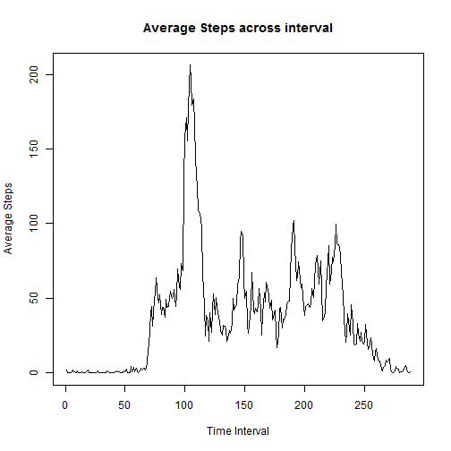

Assignment 1
========================================================
Reading the 


```r
activity <- read.csv("activity.csv")

## converting variable interval to factor variable
activity$interval <- factor(activity$interval)
```


Plotting histogram of the total number of steps taken each day


```r
histogram(activity$steps, xlab = "Steps per Day", ylab = "% Number of Days")
```

```
## Error: could not find function "histogram"
```


##Calculate and report the mean and median total number of steps taken per day

```r
steps_mm <- c("Date", "Mean Steps", "Median Steps")
for (i in levels(activity$date)) {
    sub_act <- subset(activity, activity$date == i)
    steps_mm <- c(steps_mm, i, mean(sub_act$steps, na.rm = T), median(sub_act$steps, 
        na.rm = T))
}
print(steps_mm)
```

```
##   [1] "Date"              "Mean Steps"        "Median Steps"     
##   [4] "2012-10-01"        "NaN"               NA                 
##   [7] "2012-10-02"        "0.4375"            "0"                
##  [10] "2012-10-03"        "39.4166666666667"  "0"                
##  [13] "2012-10-04"        "42.0694444444444"  "0"                
##  [16] "2012-10-05"        "46.1597222222222"  "0"                
##  [19] "2012-10-06"        "53.5416666666667"  "0"                
##  [22] "2012-10-07"        "38.2465277777778"  "0"                
##  [25] "2012-10-08"        "NaN"               NA                 
##  [28] "2012-10-09"        "44.4826388888889"  "0"                
##  [31] "2012-10-10"        "34.375"            "0"                
##  [34] "2012-10-11"        "35.7777777777778"  "0"                
##  [37] "2012-10-12"        "60.3541666666667"  "0"                
##  [40] "2012-10-13"        "43.1458333333333"  "0"                
##  [43] "2012-10-14"        "52.4236111111111"  "0"                
##  [46] "2012-10-15"        "35.2048611111111"  "0"                
##  [49] "2012-10-16"        "52.375"            "0"                
##  [52] "2012-10-17"        "46.7083333333333"  "0"                
##  [55] "2012-10-18"        "34.9166666666667"  "0"                
##  [58] "2012-10-19"        "41.0729166666667"  "0"                
##  [61] "2012-10-20"        "36.09375"          "0"                
##  [64] "2012-10-21"        "30.6284722222222"  "0"                
##  [67] "2012-10-22"        "46.7361111111111"  "0"                
##  [70] "2012-10-23"        "30.9652777777778"  "0"                
##  [73] "2012-10-24"        "29.0104166666667"  "0"                
##  [76] "2012-10-25"        "8.65277777777778"  "0"                
##  [79] "2012-10-26"        "23.5347222222222"  "0"                
##  [82] "2012-10-27"        "35.1354166666667"  "0"                
##  [85] "2012-10-28"        "39.7847222222222"  "0"                
##  [88] "2012-10-29"        "17.4236111111111"  "0"                
##  [91] "2012-10-30"        "34.09375"          "0"                
##  [94] "2012-10-31"        "53.5208333333333"  "0"                
##  [97] "2012-11-01"        "NaN"               NA                 
## [100] "2012-11-02"        "36.8055555555556"  "0"                
## [103] "2012-11-03"        "36.7048611111111"  "0"                
## [106] "2012-11-04"        "NaN"               NA                 
## [109] "2012-11-05"        "36.2465277777778"  "0"                
## [112] "2012-11-06"        "28.9375"           "0"                
## [115] "2012-11-07"        "44.7326388888889"  "0"                
## [118] "2012-11-08"        "11.1770833333333"  "0"                
## [121] "2012-11-09"        "NaN"               NA                 
## [124] "2012-11-10"        "NaN"               NA                 
## [127] "2012-11-11"        "43.7777777777778"  "0"                
## [130] "2012-11-12"        "37.3784722222222"  "0"                
## [133] "2012-11-13"        "25.4722222222222"  "0"                
## [136] "2012-11-14"        "NaN"               NA                 
## [139] "2012-11-15"        "0.142361111111111" "0"                
## [142] "2012-11-16"        "18.8923611111111"  "0"                
## [145] "2012-11-17"        "49.7881944444444"  "0"                
## [148] "2012-11-18"        "52.4652777777778"  "0"                
## [151] "2012-11-19"        "30.6979166666667"  "0"                
## [154] "2012-11-20"        "15.5277777777778"  "0"                
## [157] "2012-11-21"        "44.3993055555556"  "0"                
## [160] "2012-11-22"        "70.9270833333333"  "0"                
## [163] "2012-11-23"        "73.5902777777778"  "0"                
## [166] "2012-11-24"        "50.2708333333333"  "0"                
## [169] "2012-11-25"        "41.0902777777778"  "0"                
## [172] "2012-11-26"        "38.7569444444444"  "0"                
## [175] "2012-11-27"        "47.3819444444444"  "0"                
## [178] "2012-11-28"        "35.3576388888889"  "0"                
## [181] "2012-11-29"        "24.46875"          "0"                
## [184] "2012-11-30"        "NaN"               NA
```


Plotting average stetps per interval across dates

```r
steps <- c()
interval <- c()
max_steps <- c()
for (i in levels(activity$interval)) {
    sub_act <- subset(activity, activity$interval == i)
    ## interval <- c(interval, i)
    if (mean(sub_act$steps, na.rm = T) > max(steps)) {
        max_steps <- c(i)
    }
    steps <- c(steps, mean(sub_act$steps, na.rm = T))
}
```

```
## Warning: no non-missing arguments to max; returning -Inf
```

```r

plot(steps, type = "l", xlab = "Time Interval", ylab = "Average Steps", main = "Average Steps across interval")
```

 

```r
max_steps
```

```
## [1] "835"
```


Counting number of rows containing NA

```r
narow <- 0
for (i in 1:nrow(activity)) {
    nacount <- 0
    for (j in 1:ncol(activity)) {
        if (is.na(activity[[i, j]])) {
            nacount <- nacount + 1
        }
    }
    if (nacount == 0) {
        narow <- narow + 1
    }
}
narow
```

```
## [1] 15264
```


Creating new data set containing replaced NA values with day's mean or 0 if nan


```r
new_Act <- activity
newMean <- 0
for (i in 1:nrow(new_Act)) {
    if (is.na(new_Act$steps[i])) {
        sub_act <- subset(new_Act, new_Act$date == new_Act$date[i])
        newMean <- mean(sub_act$steps, na.rm = T)
        if (is.nan(newMean)) {
            new_Act$steps[i] <- 0
        } else {
            new_Act$steps[i] <- newMean
        }
    }
}
```

Histogram of the total number of steps taken each day on NA replacced dataset

```r
histogram(new_Act$steps, xlab = "Steps per Day", ylab = "% Number of Days")
```

```
## Error: could not find function "histogram"
```

Calculate and report the mean and median total number of steps taken per day

```{r}steps_mm_new <- c("Date", "Mean Steps", "Median Steps")
for (i in levels(new_Act$date)){
  sub_act <- subset(new_Act, new_Act$date==i)
  steps_mm_new <- c(steps_mm_new, i, mean(sub_act$steps, na.rm=T), median(sub_act$steps, na.rm=T))
}
print (steps_mm_new)
```

Are there differences in activity patterns between weekdays and weekends?

```r
new_Act$date <- as.Date(new_Act$date)
new_Act$day <- weekdays(new_Act$date)
new_Act$day <- factor(new_Act$day)
new_Act$wkday <- new_Act$day
if (new_Act$wkday == "Sunday") {
    new_Act$wkday <- 0
}
```

```
## Warning: the condition has length > 1 and only the first element will be
## used
```

```r
if (new_Act$wkday == "Saturday") {
    new_Act <- 0
}
```

```
## Warning: the condition has length > 1 and only the first element will be
## used
```

```r
if (new_Act$wkday == "Monday") {
    new_Act$wkday <- 1
}
```

```
## Warning: the condition has length > 1 and only the first element will be
## used
```

```r
if (new_Act$wkday == "Tuesday") {
    new_Act$wkday <- 1
}
```

```
## Warning: the condition has length > 1 and only the first element will be
## used
```

```r
if (new_Act$wkday == "Wednesday") {
    new_Act$wkday <- 1
}
```

```
## Warning: the condition has length > 1 and only the first element will be
## used
```

```r
if (new_Act$wkday == "Thursday") {
    new_Act$wkday <- 1
}
```

```
## Warning: the condition has length > 1 and only the first element will be
## used
```

```r
if (new_Act$wkday == "Friday") {
    new_Act$wkday <- 1
}
```

```
## Warning: the condition has length > 1 and only the first element will be
## used
```

```r

new_Act$wkday <- factor(new_Act$wkday, levels = c("Weekdays", "Weekend"))

xyplot(steps ~ interval | new_Act$wkday, type = "l", layout = c(1, 2))
```

```
## Error: could not find function "xyplot"
```

